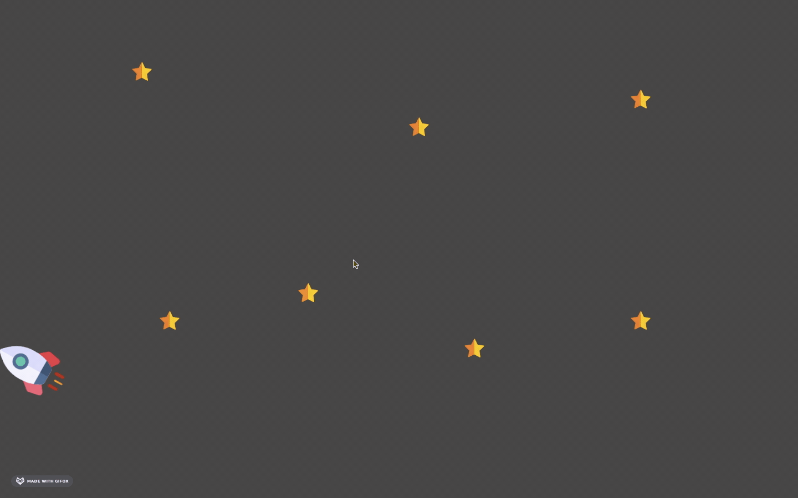

## Unique Animation Assignment - IWP Fall 2020

SVGs are downloaded off the internet and edited with Figma. CSS3 animations to create a simple and unique animation. 

1. Introduction Page with Car - Intro/intro.html - Text and SVGs (Car.svg)

1. Rocket SVG Animation with Stars - SpaceX/rocket.html - SVGs (Rocket.svg and Star.svg)

1. Lighthouse SVG Animation with tide and birds - lighthouseX/lighthouse.html - SVGs (lighthouse.svg)

